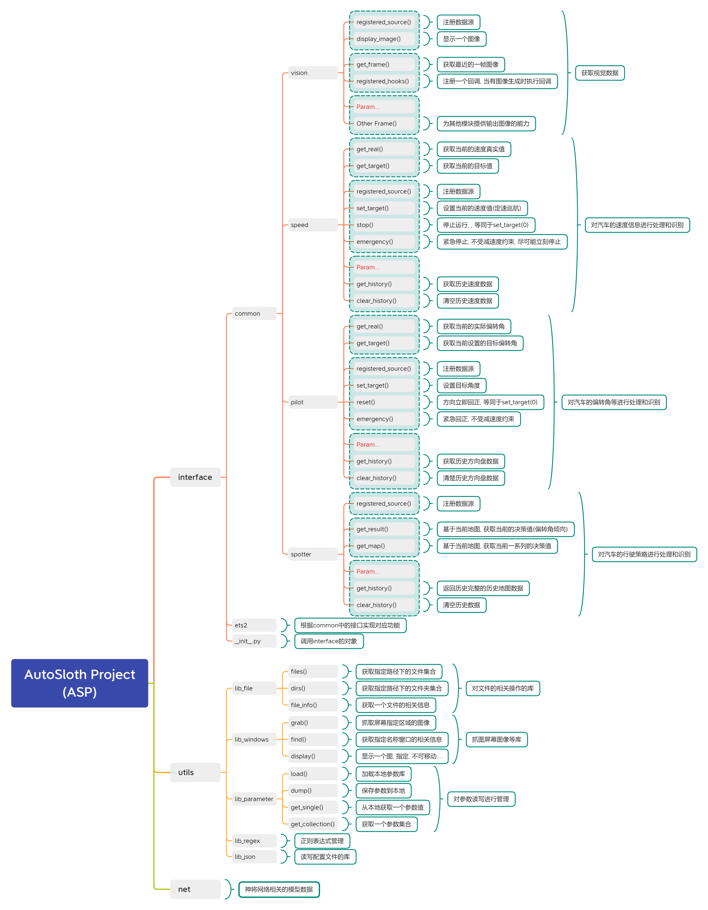

# ETS2 自动驾驶开发项目（AutoSloth）

​        去年（2021年）刚进入社会开始工作，自己挣了点钱就换了一块能“跑得动”的显卡（3080Ti），然后就想着这块显卡用来打游戏实在太可惜了， 所以想来想去就计划开个坑做点东西玩玩。我个人比较喜欢玩类似欧卡模拟2、尘埃等系列的赛车游戏的，所以就计划搞一个自动驾驶的项目来玩一玩，一来给自己无聊的工作生活增添一些色彩，二来这些祖传技能不能废弃了。

​        说起来这个项目的名字，那还是因为我个人的性格原因，我比较懒，所以总是把自己比作一个树懒（Sloth），再加上这个项目是一个自动驾驶项目，所以自然而然的就起名叫AutoSloth了，当然了，我希望我的项目最终实现的效果并不是像Sloth一样，但是我现在也不敢确定它会不会继承我的性格... ...

## I. 项目资料

​        我主要在我自己搭建的Gitea上管理这个项目，也会不定期的更新到Gitee和Github上，相关的技术文档和工作日志也会发表在哔哩哔哩和CSDN上，除了做项目，我还想跟大家做一些交流，所以才会上传到这么多平台上的

**源码托管平台（不定时更新）**

> Github: https://github.com/zzudongxiang/AutoSloth
>
> Gitee: https://gitee.com/zzudongxiang/AutoSloth

**社交媒体（知识分享）**

> bilibili: https://space.bilibili.com/246627451
>
> CSDN: https://blog.csdn.net/qq_35687030

## II. 简单聊两句

​        这个项目我目前简单构思了一下，也大致看了一些论文（毕竟不是科研狗，实在啃不动太多论文）计划了一下，就准备上手了。不过现在既然是“工程师”了，那就不能按在学校的路数来了，我得设计一个架构让整个系统能够Run起来，最好还能兼容其他游戏（想着如果做的好，未来可以套用这个框架来着）所以各个模块之间要尽可能的解耦，然后根据实际情况剥离出来一些公共的库函数，不过这些都是设想，毕竟还没真正实现。且看后期边做完善吧。

​        我目前的想法还比较简单，整个项目都是基于视觉来做的，ETS2又不会暴露接口给我用，所以我需要通过图像获取我所需要的各种信息（后面会介绍到），之前也看过一个开放接口的TORCS平台，但是我嫌弃他的画质，所以最后还是决定舍近求远，用ETS2实现整个项目。

​        如果只是我自己做这个项目，估计它十有八九可能会流产... ... 说实话，我不像稚晖君，我没有那么大的毅力，所以我把项目的进度和过程发出来，如果有那么一个两个有兴趣的朋友参与进来，甚至是闲着没事问问进度，我也好有点动力是吧，哈哈哈... ...

## III. 项目大致框架

**文档更新日期：**`2022年03月28日`
