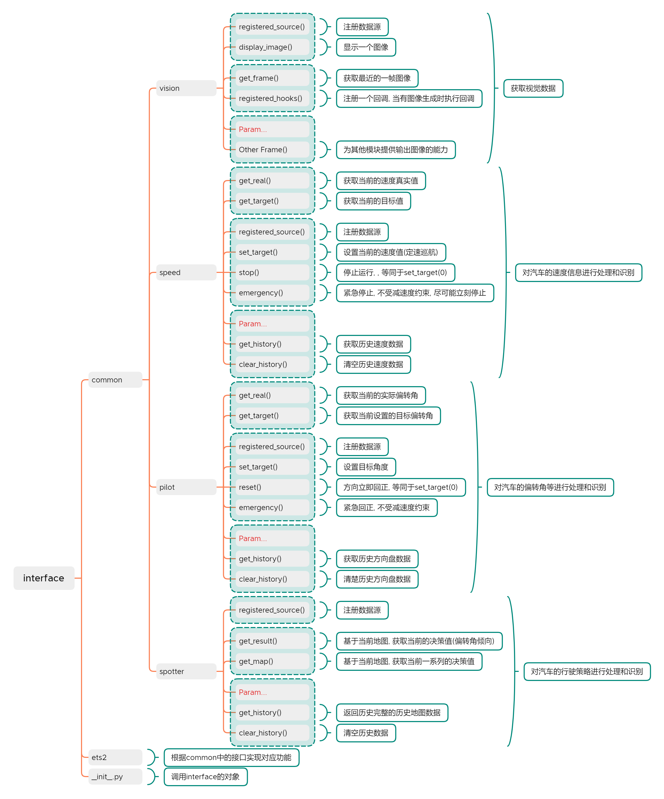

# AutoSloth

> **DateTime:** `2022年03月27日`
>
> **Author:** `zzudongxiang@163.com`

## I. 概要

去年（2021年）刚进入社会开始工作，自己挣了点钱就换了一块能“跑得动”的显卡（3080Ti），然后就想着这块显卡用来打游戏实在太可惜了， 所以想来想去就计划开个坑做点东西玩玩。我个人比较喜欢玩类似欧卡模拟2、尘埃等系列的赛车游戏的，所以就计划搞一个自动驾驶的项目来玩一玩，一来给自己无聊的工作生活增添一些色彩，二来这些祖传技能不能废弃了。

简单构思了一下，也大致看了一篇论文（毕竟不是科研狗，实在啃不动太多论文）简单计划了一下，就准备上手了。不过现在既然是“工程师”了，那就不能按在学校的路数来了，我得设计一个架构让整个系统能够Run起来，最好还能兼容其他游戏（想着如果做的好，未来可以套用这个框架来着）所以各个模块之间要尽可能的解耦，然后根据实际情况剥离出来一些公共的库函数，不过这些都是设想，毕竟还没真正实现。且看后期边做完善吧。

我目前的想法还比较简单，整个项目都是基于视觉来做的，ETS2又不会暴露接口给我用，所以我需要通过图像获取我所需要的各种信息（后面会介绍到），之前也看过一个开放接口的TORCS平台，但是我嫌弃他的画质，所以最后还是决定舍近求远，用ETS2实现整个项目。

说起来这个项目的名字，那还是因为我个人的性格原因，我比较懒，所以总是把自己比作一个树懒（Sloth），再加上这个项目是一个自动驾驶项目，所以自然而然的就起名叫AutoSloth了，当然了，我希望我的项目最终实现的效果并不是像Sloth一样，但是我现在也不敢确定它会不会继承我的性格... ...

## II. 当前进度

根据之前的设想， 大致完成了一般Interface的接口设计，主要考虑的是将一些公共方法剥离出来，同时尽可能的将对游戏的操作部分和后面的神经网络部分剥离开来，可能不见得有后续，但是一定要做个准备不是嘛

这周花了一天的时间，实现了一些基础的库，也对接口部分简单做了一部分的实现（一小部分），不过值得说一下的是，老Android工程师了，所以顺便也做了个LogV的库，主要是用习惯了，感觉这玩意设计的还是比较好用的... ... 目前这个LogV的库还有一些问题需要完善，除了性能问题之外还有一个多线程并发问题，在多线程跑起来的时候打印出来的信息有时候是错乱的，还需要做线程同步

上面提到了多线程，我想我下面可能还需要封装一个线程库，以目前的情况看，Python的多线程还没有那么的好用，有些功能还需要我自己再封装实现一下

## III. About Project

如果只是我自己做这个项目，估计它十有八九可能会流产... ... 说实话，我不像稚晖君，我没有那么大的毅力，所以我把项目的进度和过程发出来，如果有那么一个两个有兴趣的朋友参与进来，甚至是闲着没事问问进度，我也好有点动力是吧，哈哈哈... ...

不过目前该项目在我自己搭建的Gitea上面，暂时就我自己和我同事在用，如果暴露出来的话有点担心网络撑不住。不过在Github和Gitee上创建了一个镜像，只是不会同步那么及时，一般我都是做个七七八八才会同步一次... ...

> Github: https://github.com/zzudongxiang/AutoSloth
>
> Gitee: https://gitee.com/zzudongxiang/AutoSloth

## 附录: Interface FrameWorks

